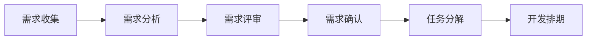
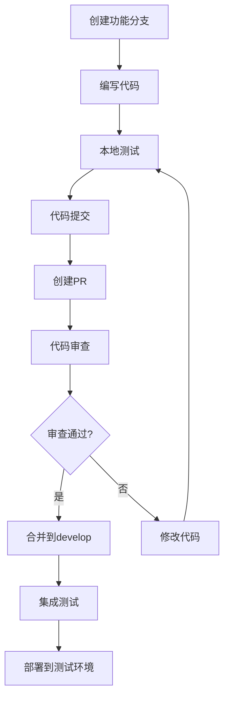
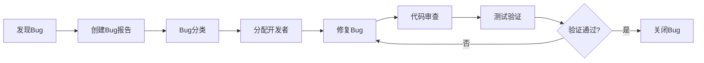

# 项目管理规范

## 一、文档概述
- **文档版本**：1.0
- **适用范围**：个人网站项目开发团队
- **管理目标**：规范开发流程、提高协作效率、确保项目质量

## 二、项目组织结构

### 2.1 团队角色定义
```
项目负责人 (Project Lead)
├── 前端开发 (Frontend Developer)
├── 后端开发 (Backend Developer)
├── UI/UX设计师 (Designer)
└── 测试工程师 (QA Engineer)
```

### 2.2 职责分工
- **项目负责人**：
  - 项目整体规划和进度管理
  - 技术方案决策
  - 团队协调和沟通
  - 风险识别和控制

- **前端开发**：
  - Vue.js应用开发
  - 用户界面实现
  - 前端性能优化
  - 浏览器兼容性测试

- **后端开发**：
  - Node.js API开发
  - 数据库设计和优化
  - 服务器部署和维护
  - 安全策略实施

- **UI/UX设计师**：
  - 界面设计和原型制作
  - 用户体验优化
  - 设计规范制定
  - 视觉资源准备

- **测试工程师**：
  - 测试用例设计
  - 功能测试和性能测试
  - Bug跟踪和回归测试
  - 测试报告编写

## 三、开发流程规范

### 3.1 需求管理流程


### 3.2 开发工作流


### 3.3 Git工作流规范
```bash
# 1. 从develop分支创建功能分支
git checkout develop
git pull origin develop
git checkout -b feature/user-authentication

# 2. 开发完成后提交代码
git add .
git commit -m "feat(auth): 实现用户登录功能"

# 3. 推送到远程仓库
git push origin feature/user-authentication

# 4. 创建Pull Request
# 在GitHub/GitLab上创建PR，请求合并到develop分支

# 5. 代码审查通过后合并
git checkout develop
git pull origin develop
git branch -d feature/user-authentication
```

## 四、任务管理

### 4.1 任务分类
- **Epic**：大型功能模块（如用户系统、博客系统）
- **Story**：用户故事（如用户可以注册账号）
- **Task**：具体开发任务（如实现注册API）
- **Bug**：缺陷修复任务
- **Spike**：技术调研任务

### 4.2 任务状态流转
```
待办 (To Do) → 进行中 (In Progress) → 代码审查 (Code Review) 
→ 测试中 (Testing) → 完成 (Done)
```

### 4.3 任务优先级
- **P0 - 紧急**：阻塞性问题，需立即处理
- **P1 - 高**：重要功能，本迭代必须完成
- **P2 - 中**：一般功能，可适当延期
- **P3 - 低**：优化类任务，时间充裕时处理

### 4.4 任务估时规范
```javascript
// 任务复杂度评估（斐波那契数列）
const storyPoints = {
  1: '非常简单（1-2小时）',
  2: '简单（半天）',
  3: '中等（1天）',
  5: '复杂（2-3天）',
  8: '很复杂（1周）',
  13: '超复杂（需要拆分）'
};

// 任务示例
const tasks = [
  {
    title: '实现用户注册API',
    storyPoints: 3,
    description: '包含参数验证、密码加密、邮箱验证',
    assignee: 'backend-dev',
    priority: 'P1'
  },
  {
    title: '设计登录页面',
    storyPoints: 2,
    description: '响应式设计，包含表单验证',
    assignee: 'frontend-dev',
    priority: 'P1'
  }
];
```

## 五、代码审查规范

### 5.1 审查清单
- [ ] **功能性**：代码是否实现了预期功能
- [ ] **可读性**：代码是否清晰易懂
- [ ] **性能**：是否存在性能问题
- [ ] **安全性**：是否存在安全漏洞
- [ ] **测试**：是否包含充分的测试用例
- [ ] **文档**：是否更新了相关文档
- [ ] **规范**：是否符合编码规范

### 5.2 审查流程
```javascript
// Pull Request模板
const prTemplate = `
## 变更描述
简要描述本次变更的内容和目的

## 变更类型
- [ ] 新功能 (feature)
- [ ] Bug修复 (bugfix)
- [ ] 文档更新 (docs)
- [ ] 样式调整 (style)
- [ ] 重构 (refactor)
- [ ] 性能优化 (perf)
- [ ] 测试 (test)

## 测试说明
- [ ] 单元测试通过
- [ ] 集成测试通过
- [ ] 手动测试完成

## 相关Issue
关联的Issue编号：#123

## 截图/录屏
如有UI变更，请提供截图或录屏

## 审查要点
需要审查者特别关注的地方
`;
```

### 5.3 审查标准
- **必须修复**：安全问题、功能缺陷、性能问题
- **建议修改**：代码风格、命名优化、注释完善
- **可选优化**：代码结构优化、性能微调

## 六、测试管理

### 6.1 测试策略
```javascript
// 测试金字塔
const testStrategy = {
  unitTests: {
    coverage: '≥80%',
    tools: ['Jest', 'Vue Test Utils'],
    scope: '单个函数/组件'
  },
  
  integrationTests: {
    coverage: '≥60%',
    tools: ['Supertest', 'MongoDB Memory Server'],
    scope: 'API接口/模块集成'
  },
  
  e2eTests: {
    coverage: '核心流程',
    tools: ['Cypress', 'Playwright'],
    scope: '完整用户场景'
  }
};
```

### 6.2 测试环境管理
```yaml
# 测试环境配置
environments:
  development:
    database: personal_website_dev
    redis: redis://localhost:6379/0
    
  testing:
    database: personal_website_test
    redis: redis://localhost:6379/1
    
  staging:
    database: personal_website_staging
    redis: redis://staging:6379/0
    
  production:
    database: personal_website_prod
    redis: redis://prod:6379/0
```

### 6.3 Bug管理流程


## 七、发布管理

### 7.1 版本号规范
```javascript
// 语义化版本控制 (Semantic Versioning)
const versionFormat = 'MAJOR.MINOR.PATCH';

// 示例
const versions = {
  '1.0.0': '首次正式发布',
  '1.0.1': '修复登录Bug',
  '1.1.0': '新增评论功能',
  '2.0.0': '重构用户系统（破坏性变更）'
};

// 版本更新规则
const versionRules = {
  MAJOR: '不兼容的API修改',
  MINOR: '向下兼容的功能性新增',
  PATCH: '向下兼容的问题修正'
};
```

### 7.2 发布流程
```bash
# 1. 创建发布分支
git checkout develop
git checkout -b release/v1.1.0

# 2. 更新版本号
npm version minor

# 3. 构建和测试
npm run build
npm run test

# 4. 合并到main分支
git checkout main
git merge release/v1.1.0

# 5. 创建标签
git tag v1.1.0

# 6. 部署到生产环境
npm run deploy:prod

# 7. 合并回develop分支
git checkout develop
git merge main
```

### 7.3 回滚策略
```javascript
// 回滚计划
const rollbackPlan = {
  // 数据库回滚
  database: {
    backup: '发布前自动备份',
    rollback: '执行回滚脚本',
    timeLimit: '30分钟内完成'
  },
  
  // 应用回滚
  application: {
    method: 'Git标签回滚',
    steps: [
      'git checkout v1.0.0',
      'npm run build',
      'npm run deploy'
    ],
    timeLimit: '15分钟内完成'
  },
  
  // 缓存清理
  cache: {
    redis: 'FLUSHDB',
    cdn: '清除CDN缓存'
  }
};
```

## 八、沟通协作

### 8.1 会议规范
- **每日站会**：
  - 时间：每天上午9:30，15分钟
  - 内容：昨日完成、今日计划、遇到问题
  - 参与者：全体开发人员

- **迭代规划会**：
  - 时间：每两周一次，2小时
  - 内容：需求评审、任务分解、工作量估算
  - 参与者：全体团队成员

- **回顾会议**：
  - 时间：每迭代结束，1小时
  - 内容：总结经验、发现问题、改进措施
  - 参与者：全体团队成员

### 8.2 文档管理
```
docs/
├── requirements/          # 需求文档
│   ├── user-stories.md
│   └── acceptance-criteria.md
├── design/               # 设计文档
│   ├── ui-mockups/
│   └── system-design.md
├── api/                  # API文档
│   └── swagger.yaml
├── deployment/           # 部署文档
│   ├── setup-guide.md
│   └── troubleshooting.md
└── meeting-notes/        # 会议记录
    ├── 2023-06-20-standup.md
    └── 2023-06-21-planning.md
```

### 8.3 知识分享
- **技术分享**：每月一次，团队成员轮流分享
- **代码走读**：重要功能完成后进行代码走读
- **文档维护**：及时更新技术文档和操作手册

## 九、质量保证

### 9.1 质量指标
```javascript
const qualityMetrics = {
  // 代码质量
  codeQuality: {
    testCoverage: '≥80%',
    codeReview: '100%',
    lintErrors: '0',
    duplicateCode: '≤5%'
  },
  
  // 性能指标
  performance: {
    pageLoadTime: '≤3s',
    apiResponseTime: '≤500ms',
    uptime: '≥99.9%'
  },
  
  // 安全指标
  security: {
    vulnerabilities: '0 high/critical',
    securityScan: '每周一次',
    accessControl: '100%覆盖'
  }
};
```

### 9.2 持续集成
```yaml
# CI/CD Pipeline
stages:
  - lint          # 代码规范检查
  - test          # 单元测试
  - build         # 构建应用
  - security      # 安全扫描
  - deploy-test   # 部署到测试环境
  - e2e-test      # 端到端测试
  - deploy-prod   # 部署到生产环境

# 质量门禁
quality_gates:
  - test_coverage: 80%
  - security_scan: pass
  - performance_test: pass
```

## 十、风险管理

### 10.1 风险识别
- **技术风险**：技术选型不当、性能瓶颈、安全漏洞
- **进度风险**：需求变更、人员变动、技术难题
- **质量风险**：测试不充分、代码质量差、用户体验问题

### 10.2 风险应对
```javascript
const riskMitigation = {
  // 技术风险
  technical: {
    prevention: '技术调研、原型验证、专家咨询',
    response: '技术方案调整、性能优化、安全加固'
  },
  
  // 进度风险
  schedule: {
    prevention: '合理估时、缓冲时间、定期检查',
    response: '优先级调整、资源增加、范围缩减'
  },
  
  // 质量风险
  quality: {
    prevention: '代码审查、自动化测试、持续集成',
    response: '增加测试、重构代码、用户反馈'
  }
};
```

### 10.3 应急预案
- **服务中断**：快速回滚、故障转移、用户通知
- **数据丢失**：数据恢复、备份验证、影响评估
- **安全事件**：立即响应、漏洞修复、安全加固
